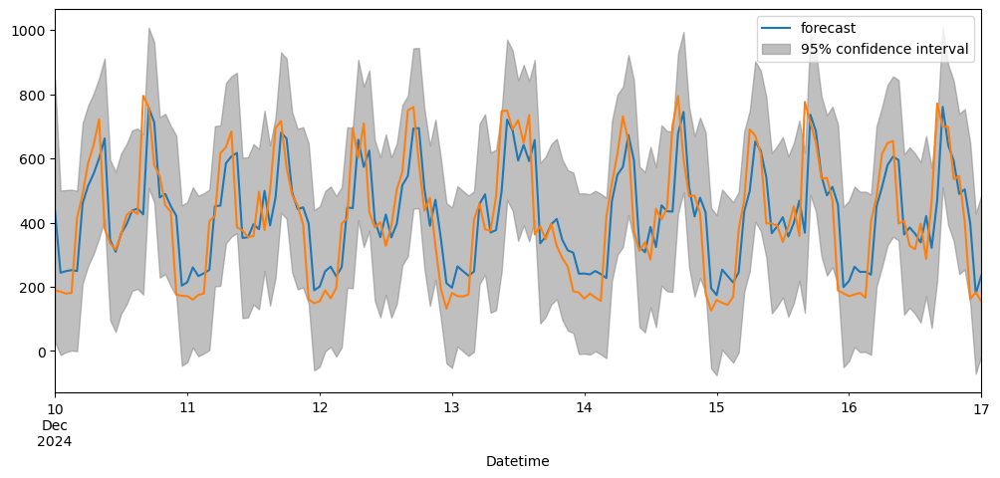
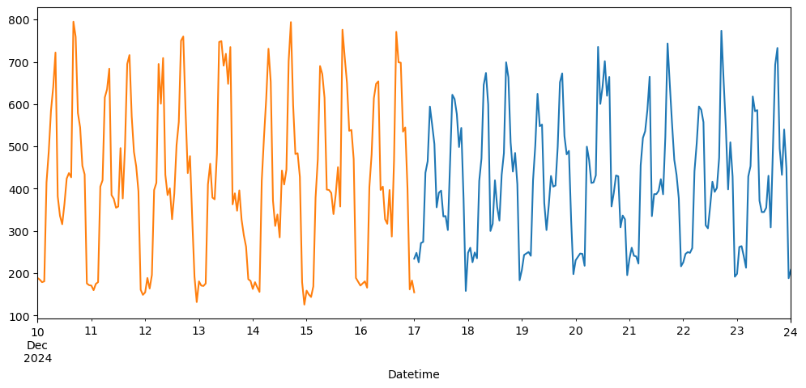
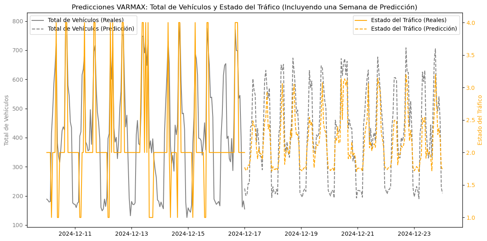
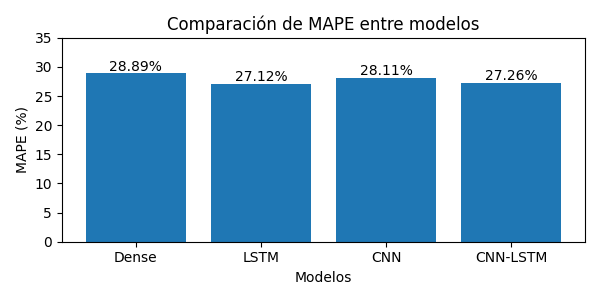

## Alumno
- Denardi, Fabricio
- Perez Winter, Alan Erik
- Pertierra, Valentin

# Carrera
Maestría en Inteligencia Artificial

# Materia
Análisis de Serie de Tiempo I

## Cohorte
01-2025

# Dataset de estudio elegido
# Real Traffic Prediction Dataset (Conjunto de datos para la predicción de tráfico real) 
## Fuente
https://www.kaggle.com/datasets/hasibullahaman/traffic-prediction-dataset?select=TrafficTwoMonth.csv

## Entendiendo el dataset
Este conjunto de datos aborda los problemas comunes de congestión vehicular en áreas urbanas. Fue creado mediante un modelo de visión por computadora que detecta cuatro tipos de vehículos: autos, motos, autobuses y camiones (el análisis del modelo de visión por computadores queda fuera del alcance de estudio). 

La información se guarda en un archivo CSV que incluye columnas como la hora, fecha, día de la semana y el conteo de cada tipo de vehículo. También contiene una columna con el total de vehículos detectados en intervalos de 15 minutos. 

Además, el dataset clasifica el estado del tráfico en cuatro niveles:
1. Bajo.
2. Normal.
3. Alto.
4. Pesado.

El dataset, actualizado cada 15 minutos durante un mes, es útil para analizar patrones de tráfico, planificar el transporte, gestionar la congestión e identificar zonas problemáticas. Permite tomar decisiones informadas sobre mejoras en la infraestructura urbana, optimización de semáforos y diseño de carriles. También apoya investigaciones sobre comportamiento del tráfico y planificación urbana sostenible.

# Pregunta de investigación
¿Podemos predecir la cantidad de vehículos en un determinado día y horario? 

Nos hacemos también una pregunta complementaria: estableciendo de antemano ciertos umbrales del estádo del tráfico, ¿podemos seguerir recomendar o evitar el uso de la autopista en análisis en dicho instante de tiempo?

### Nota
Debido a que el dataset se actualiza muy frecuentemente, optamos por trabajar con una versión local.  Los datos pueden consultarse en este [link](dataset/TrafficTwoMonth.csv).

# Resolución
Por una cuestión de organización y performance, se dividió el informe y análisis en 2.

## Modelos de Serie de tiempos univariados y vectoriales
Puede visualizar la resolución del trabajo práctico en el siguiente [link](summary.ipynb).

## Análisis con Redes Neuronales
Puede visualizar la resolución del trabajo práctico en el siguiente [link](summary_neural_networks.ipynb).

### Instalación de Paquetes
Los paquetes necesarios están listados en el archivo: *requirements.txt*

- Crear el entorno virtual: `python3.10 -m venv venv`
- Activar el entorno virtual: `source venv/bin/activate`
- Actualizar pip: `python3.10 -m pip install --upgrade pip`
- Instalar paquetes desde *requirements.txt*: `pip install -r requirements.txt`
- Desinstalar todos los paquetes: `pip freeze | xargs pip uninstall -y`
- Desactivar el entorno virtual: `deactivate`
- Eliminar el entorno virtual (opcional): `rm -rf venv`

## Modelos de Serie de Tiempos

### Métricas
| Model       | AIC           | BIC           |
|-------------|---------------|---------------|
| AR(1)       | 18760.175393  | 18776.090958  |
| AR(2)       | 18692.135715  | 18713.356468  |
| AR(5)       | 18452.806981  | 18489.943298  |
| ARMA(1,1)   | 18720.677614  | 18741.898367  |
| ARMA(1,2)   | 18659.203580  | 18685.729521  |
| Auto ARIMA  | 18856.029011  | 18887.856107  |

| Model       | MAPE          |
|-------------|---------------|
| AR(1)       | 0.2905352166  |
| AR(2)       | 0.2864607092  |
| AR(5)       | 0.2714038093  |
| ARMA(1,1)   | 0.2858290741  |
| ARMA(1,2)   | 0.2809272646  |
| Auto ARIMA  | 0.2627212320  |

## Modelo Ganador en Series de Tiempo
Analizando no solo el AIC sino también que tenga todos sus coeficientes estadísticamente significativos, dimos por "ganador" al ARMA(1,2).

### Coeficientes del modelo ARMA(1,2)
| Coeficiente | Coef.     | Std Err |    z    | P>Abs(z) | [0.025   | 0.975]   |
|-------------|-----------|---------|---------|----------|----------|----------|
| const       | 436.6174  | 13.284  | 32.869  |   0.000  | 410.582  | 462.653  |
| ar.L1       | 0.5835    | 0.040   | 14.517  |   0.000  | 0.505    | 0.662    |
| ma.L1       | 0.3124    | 0.047   | 6.583   |   0.000  | 0.219    | 0.405    |
| ma.L2       | 0.2352    | 0.040   | 5.943   |   0.000  | 0.158    | 0.313    |
| sigma2      | 1.623e+04 | 511.115 | 31.749  |   0.000  | 1.52e+04 | 1.72e+04 |

### Métricas complementarias para la segunda pregunta de investigación

| Métrica         | Valor     |
|-----------------|-----------|
| Accuracy (TS)   | 0.297715  |
| Precision (TS)  | 0.641911  |
| Recall (TS)     | 0.297715  |
| F1 Score (TS)   | 0.349572  |

# Resumen de las conclusiones
En cada apartado puede ver un detalle de las conclusiones y análisis pormenorizado, sin embargo dejamos un resumen de las conclusiones obtenidas.

1. No siempre el modelo más complejo es el mejor.El Auto ARIMA obtuvo el mejor AIC.

2. Como vemos en los histogramas de cantidad de vehículos por estado de tráfico, no siempre menos cantidad significa mayor fluidez.

3. No parece haber una relación clara entre la cantidad de vehículos y los diferentes estados del tráfico que podamos detectar con un análisis de serie de tiempo de la cantidad y mapeándola con los umbrales establecidos. En cambio, si hacemos un corte binario tenemos buenos resultados, recordemos que nuestra pregunta inicial fue si opdemos o no predecir si conviene o no utilizar la autopista analizada en un horario determinado.

## Próximos pasos
1. Tal vez con una Red Neuronal más compleja y contando con una GPU se puede explorar una solución más óptima. También el uso de frameworks de optimización, como Optuna, puede ayudarnos a elegir los mejores hiperparámetros.

2. Otro gran paso que podemos dar es hacer un análisis multivariable entre la cantidad de vehículo y el estado del tráfico (inputs), de manera tal de encontar alguna relación más allá del umbral que establecimos con el promedio.

3. Una alternativa que podemos evaluar es utilizar series de tiempo vectoriales para ver como se comportan la cantidad de vehículos y el estado del tráfico en un momento dado.

## Bonus track Modelo vectorial
Hicimos un análisis vectorial entre la cantidad de vehículos y el estado del tráfico.

### Comparación de Métricas entre Modelos de Series de Tiempo (TS) y Modelos Vectoriales (Vec)

| Métrica          | Univariada  | Vectorial   |
|------------------|-------------|-------------|
| Accuracy         | 0.297715    | 0.563844    |
| Precision        | 0.641911    | 0.701930    |
| Recall           | 0.297715    | 0.563844    |
| F1 Score         | 0.349572    | 0.516238    |

### Métricas complementarias para la segunda pregunta de investigación

| Métrica         | Valor |
|-----------------|-------|
| Accuracy        | 0.56  |
| Precision       | 0.70  |
| Recall          | 0.56  |
| F1-Score        | 0.52  |

## Conclusiones del bonus track

1. Obtuvimos un peor MAPE que el mejor modelo univariado para predecir la cantidad de vehículos en la autopista.

2. Para analizar la pregunta secundaria, por el contrario obtenemos, hemos logrado aumentar la precisión, el accuracy, recall y F1 Score.  

# Análisis complementario con redes neuronales

## Resumen Métricas

Para comparar el rendimiento de los cuatro modelos de redes neuronales (Dense, LSTM, CNN y CNN-LSTM) sobre el conjunto de test, se utiliza el MAPE (Mean Absolute Percentage Error) como métrica de evaluación. Esta métrica nos permite medir el error porcentual promedio entre las predicciones y los valores reales, facilitando la comparación directa entre los diferentes modelos.

## Conclusiones
En este análisis, se implementaron y evaluaron cuatro arquitecturas diferentes de redes neuronales para la predicción de series temporales: Dense (red neuronal densa tradicional), LSTM (Long Short-Term Memory), CNN (Red Neuronal Convolucional) y una arquitectura híbrida CNN-LSTM.

Los resultados obtenidos muestran un rendimiento similar entre los cuatro modelos, con MAPEs que oscilan entre 27% y 29%. El modelo LSTM mostró el mejor rendimiento con 27.12%, seguido por el CNN-LSTM con 27.26%, mientras que el CNN y Dense tuvieron errores ligeramente mayores de 28.11% y 28.89% respectivamente. Este nivel de error sugiere que hay espacio para mejoras en el rendimiento de los modelos.

Algunas limitaciones y posibles áreas de mejora incluyen:

1. Configuración de ventanas: Se utilizó una ventana de entrada fija de 96 datos y una ventana de salida de 1 dato. Considerando la estacionalidad diaria observada (ciclos de 96 datos) y el patrón de la serie (períodos de cambios pequeños interrumpidos por cambios significativos), podría ser beneficioso:
   - Reducir la ventana de entrada
   - Aumentar la ventana de salida
   - Experimentar con diferentes combinaciones de ambas

2. Cantidad de datos: El conjunto de datos actual es relativamente pequeño (aproximadamente 6000 muestras en 2 meses). Un conjunto de datos más extenso podría permitir:
   - Mejor aprendizaje de patrones a largo plazo
   - Mayor capacidad de generalización
   - Mejor rendimiento general de los modelos

3. Estacionalidad: La serie temporal muestra una clara estacionalidad diaria que podría aprovecharse mejor mediante:
   - Técnicas de descomposición temporal
   - Características adicionales basadas en la periodicidad
   - Arquitecturas de red específicamente diseñadas para capturar patrones cíclicos

Estas observaciones sugieren que, si bien los modelos actuales proporcionan una base sólida, existe potencial para mejorar el rendimiento mediante ajustes en el preprocesamiento de datos, la arquitectura de los modelos y la ampliación del conjunto de datos de entrenamiento.